# 🛡️ JWTs: The Passport of the Internet

**Date:** Dec 1, 2025 | **Mood:** 🔐 Cryptographic

## The Problem
API Keys are like **House Keys**. If I give you my key, you can enter my house. But the key doesn't say *who* you are, or *when* you should stop having access. It’s just a dumb piece of metal.

**JWT (JSON Web Token)** is smarter. It’s like a **Stamped Passport**.

## The Visual Structure
A JWT is just a long string of text, but it has 3 parts separated by dots (`.`).

```mermaid
---
config:
  look: neo
---
flowchart LR
 subgraph Structure["The 3 Parts"]
        Header["🔴 Header"]
        Payload["🟣 Payload"]
        Signature["🔵 Signature"]
  end
    JWT["JSON Web Token"] --> Header & Payload & Signature
    Header -- Algorithm (HS256) --- H_Desc["Metadata"]
    Payload -- User: MaveRick <br> Exp: Friday --- P_Desc["Data"]
    Signature -- Secret + Hash --- S_Desc["Security Seal"]

     Header:::Ash
    classDef Ash stroke-width:1px, stroke-dasharray:none, stroke:#999999, fill:#EEEEEE, color:#000000
    style Header fill:transparent,stroke:#333,stroke-width:2px,color:#000000
    style Payload fill:transparent,stroke:#333,stroke-width:2px,color:#000000
    style Signature fill:transparent,stroke:#333,stroke-width:2px,color:#000000
    style JWT fill:transparent
    style Structure fill:#757575
    
```

## The Anatomy of a JWT
A JWT is just a long string of text, but it has 3 parts separated by dots (`.`):

### 1. The Header (Red)
* **What it is:** Metadata.
* **Content:** "I am a JWT, and I am signed using HS256."
* **Analogy:** The cover of the passport.

### 2. The Payload (Purple)
* **What it is:** The actual data (Claims).
* **Content:** "My name is MaveRick. I am an Admin. This token expires on Friday."
* **Analogy:** The page with your photo and name.

### 3. The Signature (Blue)
* **What it is:** The security seal.
* **Content:** A mathematical hash of the Header + Payload + A Secret Password.
* **Analogy:** The holographic seal stamped by the government.

## The Magic Trick ✨
If a hacker tries to change the Payload (e.g., change "Role: User" to "Role: Admin"), the **Signature** won't match anymore because they don't know the Secret Password used to create the signature.

## Why Apigee loves JWTs
Apigee doesn't need to ask the database "Is this user valid?" every time.
Apigee just checks the **Signature**.
* If the Signature is valid → The Token is real.
* If the Signature is broken → The Token is fake. 401 Unauthorized.

## TL;DR
API Keys = "Something you have."
JWTs = "Something that proves who you are and what you can do."
